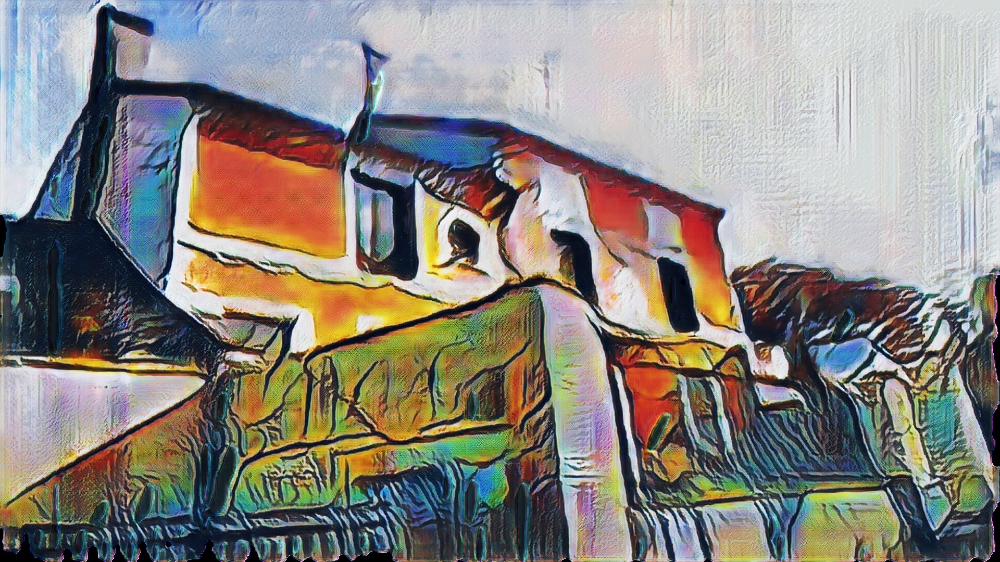

# Style Transfer

This is an implementation of [adaptive style transfer](https://arxiv.org/pdf/1807.10201.pdf) in tensorflow 2.  

It demonstrates how to:
  - Manage a dataset using tf.dataset and tfrecord files.
  - Build models using tf.keras high level API.
  - Write the training loop of a GAN using tf.function and tf.GradientTape .
  - Export and infer using tf.SavedModel, TensorRT and TfSlim.
  - Manage flags and logging using google abseil python package.
  
In the near future this code will also:
  - Allow training style transfer networks following [Cartoon-GAN paper](http://openaccess.thecvf.com/content_cvpr_2018/papers/Chen_CartoonGAN_Generative_Adversarial_CVPR_2018_paper.pdf)
   The code is writen but I'm still looking for good parameters :)
  - Demonstrate how to use style transfer on Android. I wrote models with the same kind of optimization presented in mobilenet v2 paper. The models train well, can be use
  for inference on a computer and can be exported in tfLite format but I still have some bug in the android app. 
  
Please note that the tensorflow 2 TensorRT API is still work in progress and that you need a more recent version of tensorflow than the 2.0.0a0 if you want to use
tensorRT. To compile and build a docker image with a more recent version of tensorflow 2 please see [the readme inside trt_docker subdir](trt_docker/Readme.md)

You will find some results in folder imgs. For instance:

Original image:


After style transfer with Picasso:



## Installation
The easiest way to install this style transfer is by using docker. You need to install docker, docker-compose and nvidia-docker then run: `docker-compose build style-transfer` 

## Training adaptive style transfer


- Content images used for training: [Places365-Standard high-res train images (105GB).](http://data.csail.mit.edu/places/places365/train_large_places365standard.tar)
- The research team that releases the adaptive style transfer paper also releases style image on [their owncloud](https://hcicloud.iwr.uni-heidelberg.de/index.php/s/NcJj2oLBTYuT1tf)

### Start docker
If you want to use docker for the training, a solution is to run the docker-compose `style-transfer` app. For training you need to specified 3 environments variables : 
- PICTURE_DATASET: the path of the pictures
- ART_DATASET : the path of the art images
- EXPERIMENT : the folder where the program writes logs and checkpoints

for instance run :

```bash
export PICTURE_DATASET=....
export ART_DATASET=....
export EXPERIMENT=....
docker-compose run style-transfer
```

And you will get bash prompt in a valid tensorflow 2 environment

### Start training
As soon as you are in an environment running tensorflow 2, try :

```bash
python3 app.py --action training
```

To train the model with default parameters. You can see the most important parameters with `python3 app.py --help` and all the parameters with 
`python3 app.py --helpfull`

  - If you choose to not use docker, then you probably need to change the default paths where are stored the dataset and the tfrecords. The parameters to do this are : 
  `--picture_dataset_path`, `--picture_tfrecord_path`, `--style_dataset_path`, `--style_tfrecord_path` and `--training_dir`
  - `--style_tfrecord_prefix` is also an option you should specified if you want to create several tfrecord files for several artists in the same folder.
  - If you want to train a model with the same optimizations than the mobilenet-v2 then add the flag : `--mobilenet`
 
For instance, if you want to train a picasso style transfer with the same training parameters than the original paper, you can first run 200000 iterations with a learning
rate of 0.0001 then 100000 iterations with a learning rate of 0.00002. Inside docker it will be:

```bash
python3 app.py --action training \
               --training_dir /opt/experiment/picasso \
               --style_tfrecord_prefix picasso
python3 app.py --action training \
               --training_dir /opt/experiment/picasso_2 \
               --style_tfrecord_prefix picasso \
               --n_iterations 100000 \
               --lr 0.00002 \
               --pretrained_ckpt /opt/experiment/picasso/checkpoints/
```


## Training Cartoon GAN
It is basically the same thing than training a adaptive style transfer, The only difference is that you start by an initialization where you pretrain the generative network.
Inside docker it will be :

```bash
python3 app.py --action training \
               --training_method initialization_cartoon \
               --n_iterations 50000 \
               --training_dir /opt/experiment/cartoon \
               --learning_rate 0.001

python3 app.py --action training \
               --training_method cartoon_gan \
               --n_iterations 200000 \
               --training_dir /opt/experiment/cartoon2 \
               --pretrained_ckpt /opt/experiment/cartoon/checkpoints
```

Please note the flag `--training_method` to choose if we want to train an adaptive style transfer (default), a cartoon GAN or training the generative network for the initialization 
part of the cartoon GAN.


## Export a trained model to saved_model format
To export a model you need to specified:
  - The path of checkpoint to load (can be a file or a folder. In this case it will load the more recent one)
  - The path to write the exported model
  - the export format you want to use (SavedModel, TensorRT or TfLite) and some precision (FP16 or 32 for tensorRT...)
  - The model architecture corresponding to the checkpoint (std or mobilenet)
  
For instance to export a model in TFLite format:

```bash
python3 app.py  --action export --export_format tflite --mobilenet --export_path /opt/export/model.tflite
```


## Do inference
To perform inference you need to provide :
  - The path to a exported model
  - The path of the folder containing the images, videos...
  - The path where to write the transformed images and videos

And you need to specified if your using tflite.  
 
For instance :

```bash
python3 app.py --action infer \
               --inference_model_path ... \
               --inference_input_dir ... \
               --inference_output_dir ...  \
               --inference_tflite
``` 

## Ref
Adaptative Style Transfer
  - https://github.com/CompVis/adaptive-style-transfer
  - https://compvis.github.io/adaptive-style-transfer/
  - https://arxiv.org/pdf/1807.10201.pdf
  
Instance Normalization
  - https://arxiv.org/pdf/1607.08022.pdf
